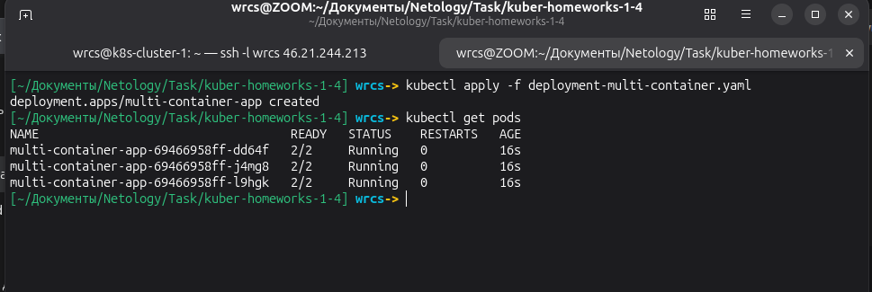
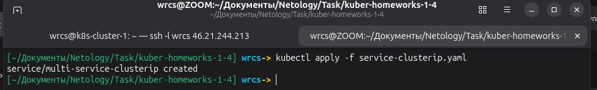
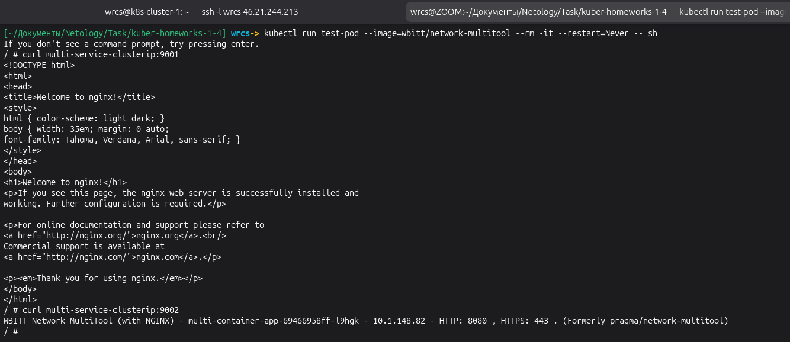
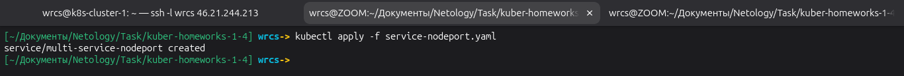
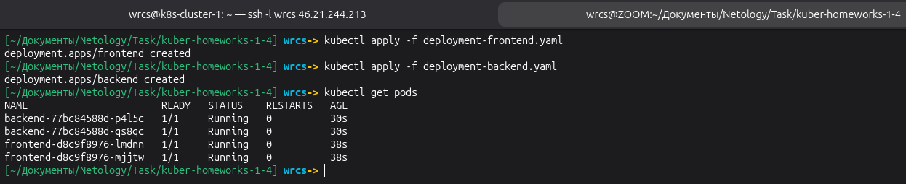
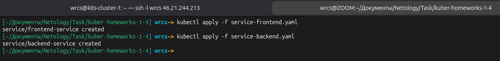
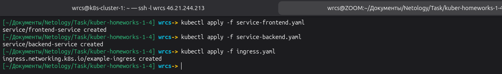
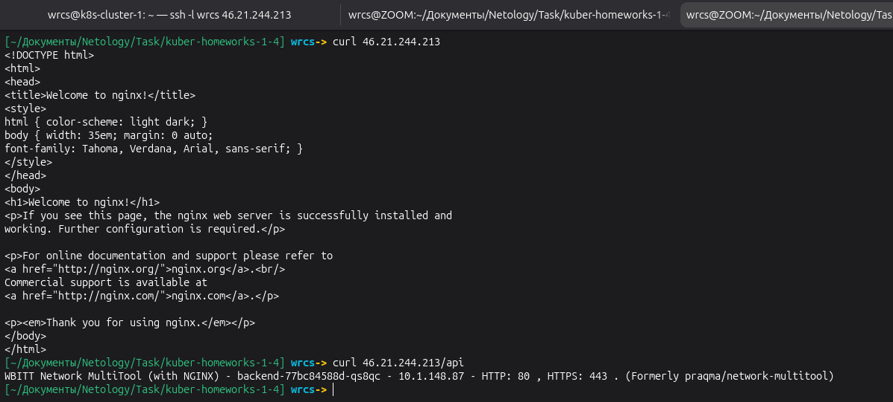

# Домашнее задание к занятию «Сетевое взаимодействие в Kubernetes» Малявко С.Н.

### Задание 1: Настройка Service (ClusterIP и NodePort)

### Задание 2: Настройка Ingress

### Файлы манифестов

- [deployment-multi-container.yaml](deployment-multi-container.yaml)
- [service-clusterip.yaml](service-clusterip.yaml)
- [service-nodeport.yaml](service-nodeport.yaml)
- [deployment-frontend.yaml](deployment-frontend.yaml)
- [deployment-backend.yaml](deployment-backend.yaml)
- [service-frontend.yaml](service-frontend.yaml)
- [service-backend.yaml](service-backend.yaml)
- [ingress.yaml](ingress.yaml)

## ✅ ЗАДАНИЕ ВЫПОЛНЕНО
